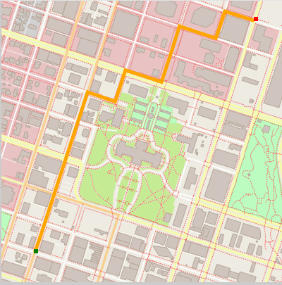

# Route Planning Project

The route planning project demonstrates the use of C++ with Open Street Map (OSM). It uses 
the A* Search algorithm to plot the shortest path on a map using starting and ending 
coordinates.

## Cloning

When cloning this project, be sure to use the `--recurse-submodules` flag. Using HTTPS:
```
git clone https://github.com/ch88251/Route-Planning-Project.git --recurse-submodules
```

## Dependencies

You'll need the following build tools and libraries installed:

* make
* cmake
* gcc/g++
* IO2D (https://github.com/cpp-io2d/P0267_RefImpl/blob/master/BUILDING.md)
 

## Building, Testing and Running

### Building
To compile the project, first, create a `build` directory and change to that directory:
```
mkdir build && cd build
```
From within the `build` directory, then run `cmake` and `make` as follows:
```
cmake ..
make
```

### Testing

The testing executable is also placed in the `build` directory. From within `build`, you can run the unit tests as follows:
```
./test
```

### Running
The executable will be placed in the `build` directory. From within `build`, you can run the executable as follows:
```
./OSM_A_star_search
```
Or to specify a map file:
```
./OSM_A_star_search -f ../<your_osm_file.osm>
```

## Demonstration

https://github.com/user-attachments/assets/2e57458f-4266-4919-9d18-f19f03a8a3f4



## References

https://wiki.openstreetmap.org/wiki/Using_OpenStreetMap

https://en.wikipedia.org/wiki/A*_search_algorithm
